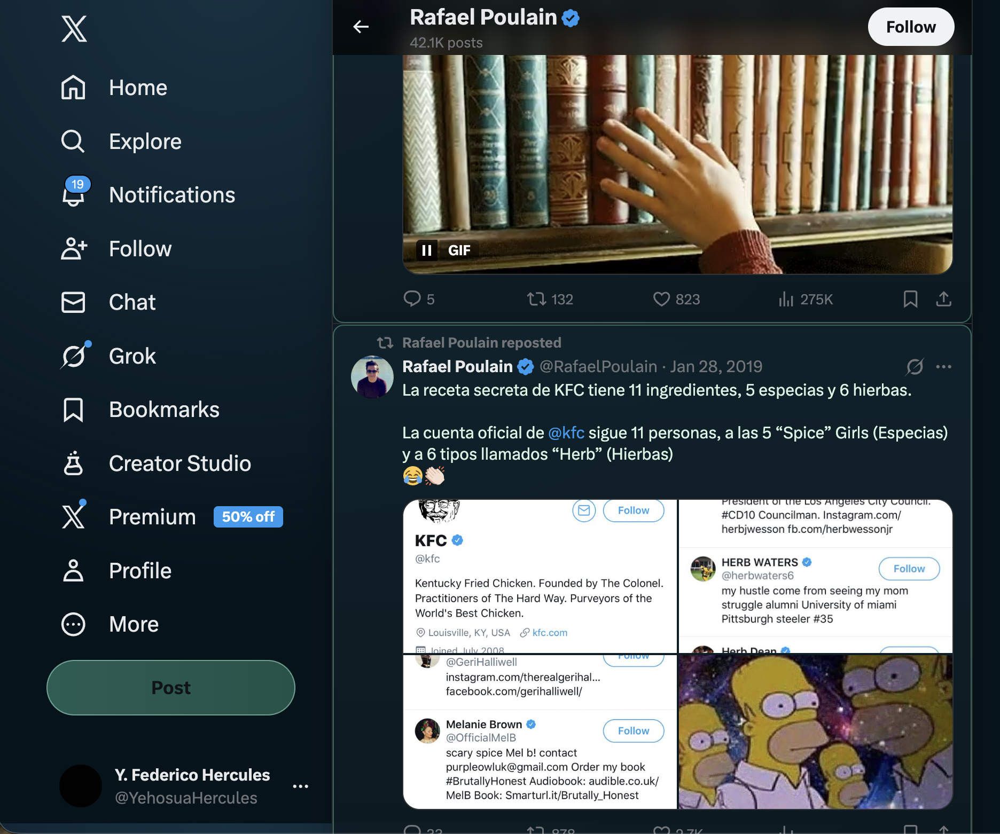
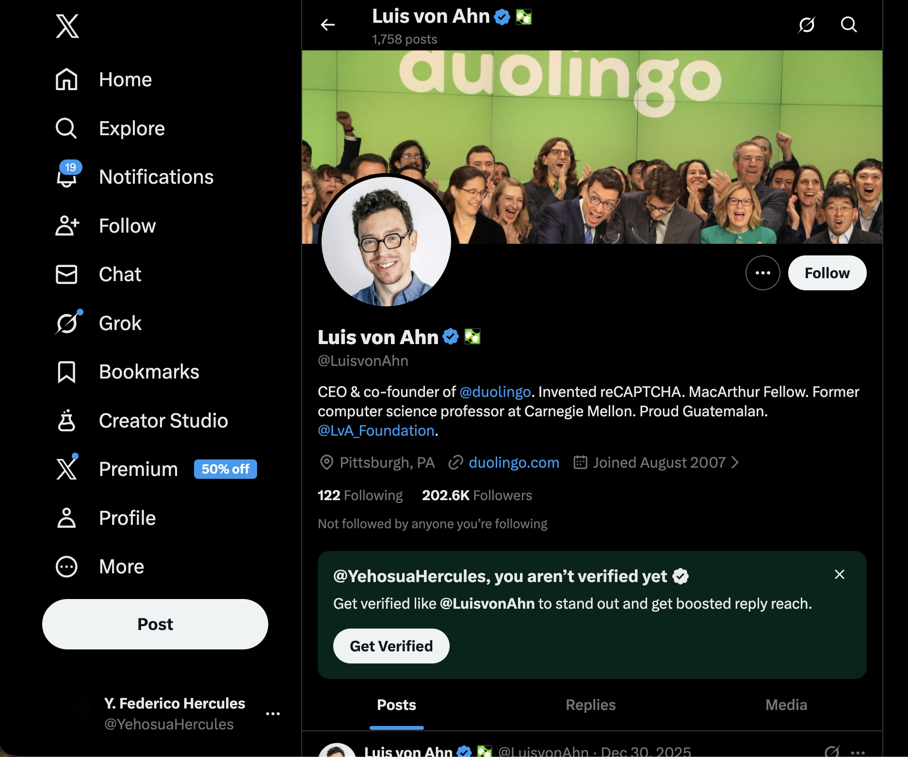

# Laboratorio1-1_SisTecWeb

## Ricing (X.com + Stylus)

El tema de Stylus se encuentra en:

- `XStylus/x-theme-terminal.css`

### Antes

### Despues

## Styling my story

La historia fue estilizada con tema terminal espacial:

- CSS principal: `site/assets/css/story.css`
- HTMLs estilizados: `site/pages/*.html`

### Antes

### Despues

## Video de demostracion

- `lab2-video.mp4`
